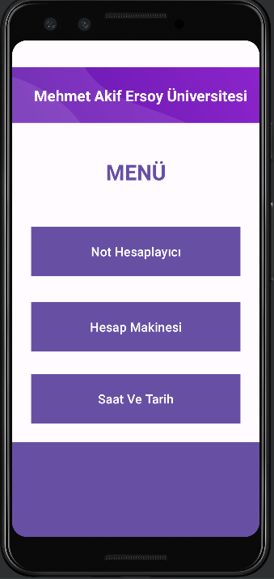
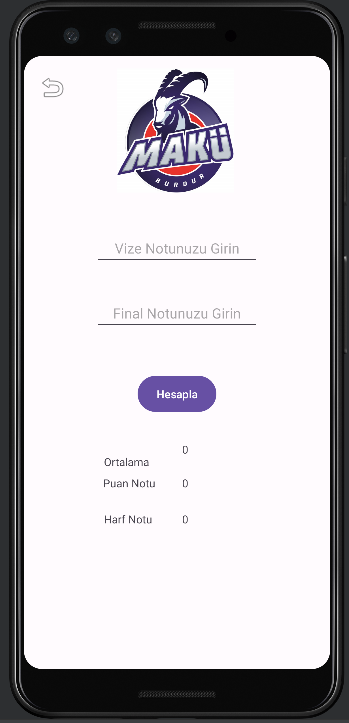
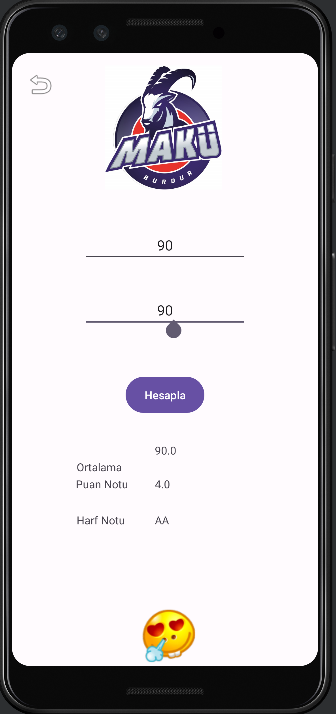

# Simple Android Application

A simple Android application designed for midterm and final exam grades, featuring an input panel with an added calculator and menus. 
The project was prepared for an assignment in the department I am studying and is deliberately kept straightforward. 
I have uploaded the project so that anyone interested can benefit from it. Hopefully, it proves useful for those who are trying to learn.

:flag_tr:
Vize, final notları için hazırlanmış içerisine bir hesap makinesi eklenmiş giriş paneli ve menülerden oluşan basit bir android uygulaması.
Proje okuduğum bölümün ödevi için hazırlanmış olup oldukça basit ele alınmıştır.
Projeyi ilgisi olan herkesin faydalanabilmesi için yükledim. Umarım öğrenmeye çalışan birilerinin işine yarar.

# Projenin Ana Ekranı

Ana ekran üzerinde basit bir öğrenci numarası ve şifre ile giriş bulunmaktadır. Bunun yanında sosyal medya hesapları eklenmiştir.

On the main screen, there is a simple login with a student number and password. In addition, social media accounts have been added.

# Menü Ekranı

Menü üzerinde 3 adet seçenek eklenmiştir. Bu seçenekler ilgili uygulamalara yönlendirmektedir.

Three options have been added to the menu. These options redirect to their respective applications.

# Vize Final Hesaplayıcı

Bu ekranımızda vize ve final notlarını hesaplayan uygulama bulunmaktadır. Uygulama notları hesaplayarak kullanıcının harf notunu, puan durumunu ve ortalamasını vermekle birlikte nota bağlı olarak emoji görüntülemektedir.

On this screen, there is an application that calculates midterm and final grades. The application provides the user with the letter grade, grade status, and average by calculating the grades. Additionally, it displays an emoji based on the grade.

# Hesap Makinesi

Bu ekranımızda ise basit bir hesap makinesi bulunmaktadır. Kullanıcının girdiği sayıya ve seçtiği işleme bağlı olarak sonucu göstermektedir.

On this screen, there is a simple calculator. It displays the result based on the number entered by the user and the operation selected.
